# ADR 0003 — Datenmodell in PostgreSQL

**Status:** angenommen
**Datum:** 2026-08-28
**Betrifft:** `services/api/migrations/`, `packages/schemas/sql/`

---

## Kontext

Kapitel 3 des Konzepts verlangt ein Datenmodell für alles: Flugzeug, Erdbeben und
Zinsentscheid teilen sich dieselbe Grundstruktur. Kapitel 15 verlangt, dass
PostgreSQL relationale Daten, Geometrie und Zeitreihen in _einem_ System hält.
Kapitel 3.4 verlangt Bitemporalität — die Frage „was wussten wir am 12.03. um
04:00" muss beantwortbar sein, nicht nur „was wissen wir heute darüber".

Die Protobuf-Schemas aus ADR-Vorlauf (Prompt 1) sind die Wahrheitsquelle für die
Datenstrukturen. Dieses ADR hält fest, wie sie auf PostgreSQL abgebildet werden
und wo die Abbildung bewusst nicht 1:1 ist.

---

## Entscheidungen

### 1. `observed_at` ist in der Datenbank NOT NULL — die Unterscheidung wandert in `time_quality`

Im Protobuf ist `Observation.observed_at` `optional`: fehlt der Quellzeitstempel,
fehlt das Feld. Das ist die schemagewordene Fassung von Prinzip 4.

In der Datenbank geht das nicht: `observed_at` ist der Partitionsschlüssel, und
ein Partitionsschlüssel darf nicht NULL sein — weder bei einer
TimescaleDB-Hypertable noch bei nativer Bereichspartitionierung.

**Entschieden:** `observed_at timestamptz NOT NULL` als _wirksame_ Valid Time,
plus `time_quality` aus dem Protobuf als eigene Spalte. Fehlt der
Quellzeitstempel, setzt die Pipeline `observed_at = ingested_at` **und**
`time_quality = 'inferred_from_ingest'`. Ein CHECK erzwingt diese Kopplung:

```sql
CONSTRAINT observations_time_quality_consistent
    CHECK (time_quality <> 'inferred_from_ingest' OR observed_at = ingested_at)
```

Die Unterscheidung geht damit nicht verloren, sie wechselt nur die Spalte. Ein
Ersatzwert kann nicht wie eine Messung aussehen — genau das war der Zweck des
`optional` im Protobuf.

**Verworfene Alternative:** `observed_at` nullable lassen und nach `ingested_at`
partitionieren. Dann läge eine Beobachtung vom 12.03. in der Partition des
Ingest-Tages; jede Zeitreise und jede Retention-Regel würde falsch greifen.

### 2. Enum-Bezeichner ohne Präfix, kleingeschrieben

Protobuf: `ENTITY_TYPE_VESSEL`. SQL: `'vessel'` im Typ `argus.entity_type`.

Der Typname trägt den Namensraum bereits; das Präfix wäre in jeder Abfrage
Rauschen. Die Abbildung ist mechanisch (Präfix streichen, kleinschreiben) und
gehört in den generierten SDK-Code, nicht in Handarbeit.

**Konsequenz:** Ein neuer Enum-Wert braucht eine Migration mit
`ALTER TYPE ... ADD VALUE`. Das kann in PostgreSQL nicht in derselben
Transaktion benutzt werden, in der es angelegt wurde — bei Enum-Erweiterungen
also eine eigene Migration.

### 3. Bitemporalität über `sys_period` plus Verlaufstabelle, per Trigger

Jede versionierte Tabelle (`events`, `entities`, `relations`) hat:

- `sys_period tstzrange NOT NULL` — Gültigkeit _dieser Fassung im System_
- eine Zwillingstabelle `<name>_history` mit identischen Spalten
- einen `BEFORE UPDATE OR DELETE`-Trigger, der die abgelöste Fassung mit
  geschlossenem Intervall in den Verlauf schreibt

Damit reihen sich die Intervalle lückenlos und überlappungsfrei aneinander: zu
jedem Zeitpunkt T gibt es **genau eine** Fassung mit `sys_period @> T`. Die
Funktion `argus.event_as_of(event_id, T)` vereinigt aktuelle und historische
Tabelle.

**`clock_timestamp()` statt `transaction_timestamp()`.** Mehrere Änderungen
innerhalb einer Transaktion bleiben so unterscheidbar und erzeugen keine leeren
Intervalle. Preis: die Transaktionszeit ist die Anweisungszeit, nicht der
Commit-Zeitpunkt. Für die Frage „was wussten wir wann" ist die Anweisungszeit
die ehrlichere Angabe.

**Verworfene Alternative:** die Erweiterung `temporal_tables`. Sie tut dasselbe,
ist aber eine weitere Abhängigkeit, die im Image vorhanden sein muss — für rund
20 Zeilen PL/pgSQL kein guter Tausch.

### 4. Geometrie doppelt indiziert: `geography` mit GiST und `h3_r7 bigint` mit B-Tree

- `geography(Point, 4326)` + GiST für exakte Abstände, Polygon-Enthaltensein und
  AOI-Prüfung.
- `h3_r7 bigint` + B-Tree für Viewport- und Nachbarschaftsabfragen. Ein
  Ganzzahlvergleich schlägt jede Geometrieoperation, solange die Auflösung passt.

`geography` statt `geometry`: Entfernungen sind in Metern auf dem Ellipsoid
korrekt, ohne dass jede Abfrage eine Projektion wählen muss. Bei maritimen und
Luftfahrtdaten über große Distanzen ist das der Unterschied zwischen richtig und
plausibel-aussehend.

H3-Indizes als `bigint`, nicht als `text`: ein H3-v4-Index passt in einen
vorzeichenbehafteten 64-Bit-Wert, und der Vergleich ist um ein Vielfaches
billiger als auf Zeichenketten.

### 5. Ein Punkt gröber als „building" muss als abgeleitet markiert sein

```sql
CONSTRAINT events_derived_point_marked
    CHECK (geo_point IS NULL
           OR geo_precision IN ('exact', 'building')
           OR geo_point_is_derived)
```

Die Regel aus Kapitel 3.5 („nie eine Länderangabe als Punkt in der Landesmitte,
ohne die Präzision zu markieren") ist damit nicht mehr Konvention, sondern von
der Datenbank durchgesetzt.

### 6. Volltext als generierte `tsvector`-Spalte mit sprachabhängiger Konfiguration

```sql
search_tsv tsvector GENERATED ALWAYS AS (
    setweight(to_tsvector(argus.ts_config(lang), coalesce(title, '')), 'A') || ...
) STORED
```

`argus.ts_config(text) RETURNS regconfig` ist als `IMMUTABLE` markiert — nur so
darf sie in einer generierten Spalte stehen. Sprachen ohne Wörterbuch bekommen
`'simple'`: besser keine Stammformbildung als eine falsche.

**Konsequenz:** Ändert sich die Zuordnung in `argus.ts_config`, sind bestehende
`tsvector`-Werte veraltet. Ein `UPDATE ... SET lang = lang` der betroffenen
Zeilen erneuert sie. Das gehört in die Migration, die die Funktion ändert.

**Verworfene Alternative:** Trigger statt generierter Spalte. Ein Trigger kann
vergessen werden, eine generierte Spalte nicht.

### 7. Score-Faktoren als Tabelle, nicht als JSONB

Kapitel 7.3 verlangt, dass jeder Score in seine Faktoren zerlegbar ist. Die
Frage „welcher Faktor dominiert über alle Ereignisse der letzten Woche" ist eine
Aggregation und gehört relational beantwortet. `argus.score_factors` ist deshalb
eine eigene Tabelle mit `(score_id, factor)` als Schlüssel.

JSONB gibt es nur dort, wo die Struktur wirklich offen ist: `attributes`
(quellspezifische Zusatzfelder), `evidence` (Belege wechselnder Form),
`event_contradictions.claims` (konkurrierende Werte beliebigen Typs).

### 8. `entity_aliases` mit `UNIQUE (id_type, id_value)`

Der Kern der Entity Resolution: derselbe Bezeichner darf nie auf zwei Entitäten
zeigen. Der Constraint ist die Stelle, an der eine doppelte Zuordnung auffällt —
bevor zwei Entitäten stillschweigend dieselbe IMO tragen.

Zeitliche Gültigkeit steht in `validity tstzrange`: eine MMSI gehört nur zeitweise
zu einem Schiff. Der Unique-Constraint ist bewusst **nicht** zeitlich gestaffelt
— eine wiederverwendete MMSI ist ein Fall für die Review-Queue, nicht für eine
automatische Auflösung.

### 9. Fremdschlüssel: `SET NULL` auf Entitäten, `RESTRICT` auf Quellen

`observations.entity_id` → `ON DELETE SET NULL`. Eine gelöschte oder
zusammengeführte Entität darf keine Beobachtungen vernichten; `ref_id` behält die
Rohaussage der Quelle (`'mmsi:211234560'`) und ist erneut auflösbar.

`observations.source_id` → `ON DELETE RESTRICT`. Eine Quelle zu löschen, deren
Daten noch da sind, würde die Provenienzkette zerreißen — Prinzip 1 verbietet das.

Die Invariante `argus.assert_foreign_keys_have_delete_rule()` schlägt fehl, sobald
ein Fremdschlüssel ohne ausdrückliches `ON DELETE` angelegt wird.

### 10. TimescaleDB mit nativer Partitionierung als Rückfallebene

`ARGUS_TIMESCALE=auto|on|off` steuert, ob `observations` eine Hypertable oder
eine nativ nach `observed_at` partitionierte Tabelle wird. Beide Varianten haben
dieselbe Tabellenform und dieselben Indizes.

Grund: TimescaleDB steht unter der Timescale License (TSL), nicht unter Apache.
Kompression und Continuous Aggregates gibt es nur dort. Wer die Lizenz nicht
einsetzen darf, bekommt mit `off` ein funktionierendes Schema — ohne
automatische Kompression, dafür mit `argus.observations_maintenance()` für
Partitionsverwaltung und Retention.

---

## Entity-Relationship-Diagramm

Kernobjekte und ihre Beziehungen. Verlaufstabellen (`*_history`) sind
weggelassen — sie sind strukturgleiche Zwillinge der jeweiligen Haupttabelle.

```mermaid
erDiagram
    SOURCES ||--o{ ENTITIES : liefert
    SOURCES ||--o{ EVENTS : liefert
    SOURCES ||--o{ REPORTS : liefert
    SOURCES ||--o{ OBSERVATIONS : liefert
    SOURCES ||--o{ SOURCE_RELIABILITY_CHANGES : "bewertet ueber Zeit"
    SOURCES ||--o{ DATA_GAPS : "hat Luecken"

    ENTITIES ||--o{ ENTITY_ALIASES : "hat Bezeichner"
    ENTITIES ||--o{ ENTITY_SANCTIONS : "hat Treffer"
    ENTITIES ||--o{ OBSERVATIONS : "wird beobachtet"
    ENTITIES ||--o{ TRACKS : "hat Spur"
    ENTITIES ||--o{ EVENT_ENTITIES : "ist beteiligt"
    ENTITIES ||--o{ REPORT_MENTIONS : "wird erwaehnt"
    ENTITIES ||--o{ RELATIONS : "ist Ausgangspunkt"
    ENTITIES ||--o| ENTITIES : "zusammengefuehrt in"

    EVENTS ||--o{ EVENT_ENTITIES : "beteiligt"
    EVENTS ||--o{ EVENT_REPORTS : "belegt durch"
    EVENTS ||--o{ EVENT_LINKS : "verknuepft mit"
    EVENTS ||--o{ EVENT_CONTRADICTIONS : "hat Widerspruch"

    REPORTS ||--o{ EVENT_REPORTS : belegt
    REPORTS ||--o{ REPORT_MENTIONS : erwaehnt
    REPORTS ||--o{ REPORT_PLACES : verortet
    REPORTS ||--o{ REPORT_TRANSLATIONS : "uebersetzt in"

    TRACKS ||--o{ TRACK_GAPS : "hat Luecken"
    TRACKS ||--o{ OBSERVATIONS : "besteht aus"

    AOIS ||--o{ ALERTS : "loest aus in"
    WATCHLISTS ||--o{ WATCHLIST_MEMBERS : enthaelt
    ALERTS ||--o{ ALERT_NOTIFICATIONS : "zugestellt ueber"
    CASES ||--o{ CASE_ITEMS : enthaelt
    CASES ||--o{ CASE_NOTES : enthaelt
    CASES ||--o{ ALERTS : "buendelt"
    SCORES ||--o{ SCORE_FACTORS : "zerlegt in"

    SOURCES {
        text source_id PK
        text license_id "Pflicht - CI-Gate Kapitel 14"
        enum reliability "Admiralty A-F"
        boolean enabled "Kill-Switch"
    }
    ENTITIES {
        text entity_id PK "ULID"
        enum type
        text display_name
        geography last_known_position
        tstzrange sys_period "bitemporal"
        boolean contains_personal_data "DSGVO"
    }
    ENTITY_ALIASES {
        bigint alias_id PK
        text id_type UK "imo, mmsi, lei, ..."
        text id_value UK
        tstzrange validity "MMSI wechselt"
    }
    OBSERVATIONS {
        text obs_id PK
        timestamptz observed_at PK "Partitionsschluessel"
        enum time_quality "Herkunft des Zeitstempels"
        geography geo
        bigint h3_r7 "B-Tree fuer Viewport"
        text dedupe_key "Idempotenz"
    }
    EVENTS {
        text event_id PK
        text type "Taxonomiepfad"
        timestamptz occurred_start "Valid Time"
        timestamptz ingested_at "Transaction Time"
        tstzrange sys_period "bitemporal"
        enum status "rumored..retracted"
        tsvector search_tsv "generiert"
    }
    REPORTS {
        text report_id PK
        bigint simhash "Near-Duplicate"
        text story_cluster_id
        boolean body_withheld_for_license
        tsvector search_tsv "generiert"
    }
    RELATIONS {
        text relation_id PK
        enum relation_type
        tstzrange validity "wer gehoerte wann zu wem"
        tstzrange sys_period "bitemporal"
    }
    SCORES {
        bigint score_id PK
        double priority "0..100"
        text weights_version "Reproduzierbarkeit"
    }
    SCORE_FACTORS {
        text factor PK
        double contribution "raw * weight"
        text detail "Wasserfalldiagramm"
    }
```



---

## Konsequenzen

**Positiv**

- Eine Zeitreise ist eine Abfrage, kein Rekonstruktionsprojekt.
- Die Kernprinzipien sind von der Datenbank durchgesetzt, nicht nur dokumentiert:
  markierte Ableitung, gekoppelte Zeitqualität, Belegpflicht bei Modell-Aussagen,
  ein offener Alarm je Sachverhalt.
- Die DDL-Referenz unter `packages/schemas/sql/` wird generiert und kann nicht
  abweichen.
- Der Stack läuft auch ohne TimescaleDB.

**Negativ**

- Acht Migrationen mit ausformuliertem DDL statt ORM-Modellen. Autogenerate ist
  aus; jede Änderung ist Handarbeit. Das ist der Preis dafür, dass PostGIS-Typen,
  Trigger, generierte Spalten und Partitionierung korrekt abgebildet sind.
- Verlaufstabellen verdoppeln den Speicherbedarf viel geänderter Objekte.
- Enum-Erweiterungen brauchen jeweils eine eigene Migration.
- Die Zwei-Wege-Partitionierung (Timescale / nativ) ist zusätzliche Fläche, die
  getestet werden muss.

**Revidieren, wenn**

- die Verlaufstabellen dominieren — dann gehört der Verlauf in ClickHouse und
  PostgreSQL behält nur ein begrenztes Fenster;
- die Zahl der Ereignistypen so stabil wird, dass ein Enum den String schlägt;
- TimescaleDB lizenzrechtlich ausscheidet — dann fällt der `on`-Pfad weg und die
  Kompression muss anders gelöst werden.

---

## Nachgewiesen

Auf PostgreSQL 16.15 mit PostGIS 3.4.2, pgvector 0.6.0, `ARGUS_TIMESCALE=off`:

| Kriterium                                           | Ergebnis                                                                                            |
| --------------------------------------------------- | --------------------------------------------------------------------------------------------------- |
| `alembic upgrade head` / `downgrade base`           | beide fehlerfrei, dreimal wiederholt                                                                |
| jede Migration einzeln vor und zurück               | fehlerfrei                                                                                          |
| 1 Mio. Beobachtungen laden (Budget 90 s)            | **38,6 s**, 25.881 Zeilen/s, 646 MB inkl. Indizes                                                   |
| „alle Beobachtungen einer Entität der letzten 24 h" | Bitmap Index Scan auf `observations_entity_time_idx`, **0,8 ms** Ausführung (7,95 ms inkl. Planung) |
| Zustand eines Ereignisses zum Zeitpunkt T           | korrekte historische Fassung, genau eine Zeile je Zeitpunkt                                         |
| Schema-Invarianten                                  | keine naiven Zeitstempel, kein Fremdschlüssel ohne `ON DELETE`                                      |
